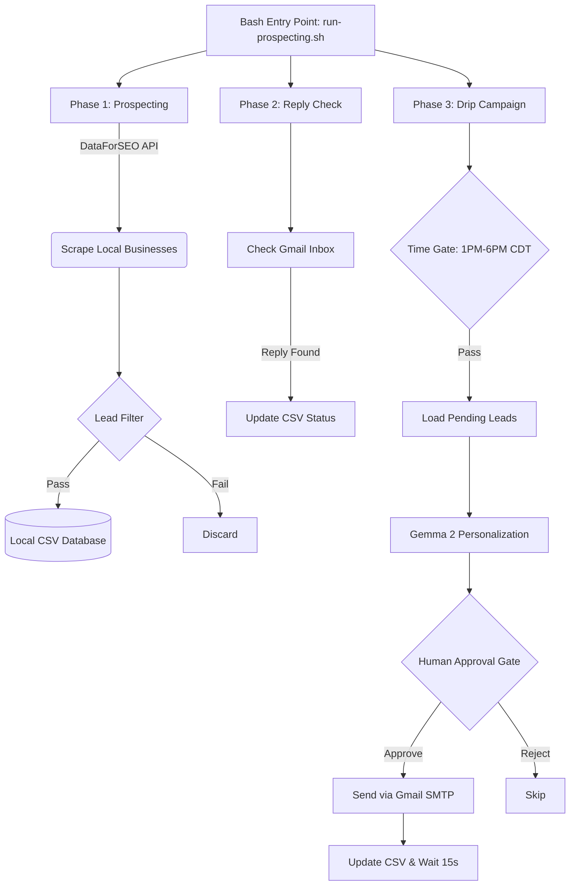

# Hermes: Automated AI Prospecting & Cold Email Pipeline

## Overview
Hermes is a fully automated, human-in-the-loop cold email prospecting system designed to identify, qualify, and engage local service businesses. Built as a multi-phase pipeline, it integrates Google Maps scraping (via DataForSEO), a local CSV database, AI-driven email personalization (Gemma 2 via Ollama), and Gmail SMTP delivery. 

This system was engineered from the ground up to solve the problem of scaling personalized outreach without sacrificing quality or deliverability. It serves as a practical demonstration of full-stack AI system architecture, data pipeline engineering, and quality assurance principles applied to real-world business automation.

## System Architecture
The pipeline is structured into three distinct phases, orchestrated by a central Python controller (`hermes_main.py`) and initiated via a Bash script (`run-prospecting.sh`) that integrates with an Agentic OS Kanban board for task tracking.



## Tech Stack
| Component | Technology | Purpose |
| :--- | :--- | :--- |
| **Core Logic** | Python 3 | Pipeline orchestration, data manipulation, API integration |
| **Data Scraping** | DataForSEO API | Extracting local business data from Google Maps |
| **AI Personalization** | Ollama (Gemma 2) | Generating hyper-personalized, context-aware email copy |
| **Email Delivery** | Gmail SMTP | Sending emails with a 15-second drip delay to protect deliverability |
| **Database** | Pandas / CSV | Local, lightweight data storage and state management |
| **Task Tracking** | Next.js / Node.js | Agentic OS Kanban board integration via REST API |
| **Automation** | Bash / Zsh | Command-line alias (`prospect`) and script execution |

## Core Components Breakdown

### 1. Prospecting Engine (Phase 1)
The system targets 11 specific niches (HVAC, Plumbing, Roofing, Electrical, Landscaping, Pest Control, Water Damage, House Cleaning, Garage Door, Pool Service, Tree Service) across mid-tier cities. It queries the DataForSEO API to extract business listings, applying strict filtering criteria:
- **Review Count Thresholds:** Ensuring the business has enough traction to be viable.
- **Rating Thresholds:** Identifying businesses with solid foundations but room for improvement.
- **Chain Exclusion:** Filtering out national chains or franchises to focus on independent local operators.
- **Deduplication:** Checking against the existing `HermesColdEmailList.csv` to prevent duplicate outreach.

### 2. Reply Checker (Phase 2)
Before sending new emails, the system scans the connected Gmail inbox for replies from previously contacted leads. If a reply is detected, the lead's status is updated in the CSV database, ensuring no automated follow-ups are sent to engaged prospects.

### 3. AI Email Sender (Phase 3)
This component loads unsent leads and utilizes a local instance of Gemma 2 (via Ollama) to generate a single, highly personalized sentence based on the business's actual review data (e.g., "You've got 12 reviews and a 4.8-star rating — a solid foundation, but your competitors in this market are pulling further ahead every month."). This sentence is injected into one of three pre-written email templates.

### 4. Human-in-the-Loop & Safety Mechanisms
To ensure quality and protect domain reputation, several safety mechanisms are engineered into the pipeline:
- **Time-Gated Sending:** Emails are strictly limited to sending between 1:00 PM and 6:00 PM CDT.
- **Human Approval Gate:** Currently implemented via the Terminal, every generated email must be manually approved (`y/n`) before sending. This ensures AI outputs are QA'd prior to delivery.
- **Drip Delay:** A 15-second delay is enforced between sends to mimic human behavior and avoid triggering spam filters.
- **Daily Limits:** A hard cap of 20 emails per day is enforced.

## Setup and Installation

### Prerequisites
- Python 3.10+
- Ollama installed locally with the `gemma2` model pulled (`ollama run gemma2`)
- A Gmail account with an App Password generated
- DataForSEO API credentials
- Node.js (for the Agentic OS Kanban board)

### Installation
1. Clone the repository:
   ```bash
   git clone https://github.com/yourusername/hermes-agent-prospecting-system.git
   cd hermes-agent-prospecting-system
   ```

2. Install Python dependencies:
   ```bash
   pip install pandas requests
   ```

3. Configure Environment Variables / Credentials:
   - Update `GMAIL_USER` and `GMAIL_APP_PASSWORD` in `email_sender.py`.
   - Ensure your DataForSEO credentials are set in `prospecting_script.py`.

4. Set up the Terminal Alias:
   Add the following to your `~/.zshrc` or `~/.bash_profile`:
   ```bash
   alias prospect='~/path/to/hermes-agent-prospecting-system/run-prospecting.sh'
   ```
   Then reload your shell: `source ~/.zshrc`

## Usage
To initiate a prospecting run for a specific city, simply use the terminal alias:

```bash
prospect "Huntsville, AL"
```

The system will:
1. Create a Kanban card in the Agentic OS.
2. Scrape DataForSEO for the 11 target niches in Huntsville, AL.
3. Filter and deduplicate the leads, saving them to the CSV database.
4. Check for replies.
5. (If between 1PM-6PM CDT) Generate personalized emails and prompt for approval in the terminal.
6. Update the Kanban card with the final execution summary.

## Engineering Notes & Design Decisions
- **Local AI over Cloud API:** Utilizing Ollama and Gemma 2 locally ensures zero variable costs for token generation and maintains complete data privacy for lead information.
- **CSV over SQL:** For the scale of this operation (hundreds to thousands of leads, not millions), a flat CSV file provides maximum portability and allows for easy manual inspection and editing without requiring database management tools.
- **Strict Prompt Engineering:** The prompt provided to Gemma 2 is heavily constrained to output *exactly* one sentence, enforcing specific formatting for ratings (e.g., "4.8-star rating") to prevent truncation or hallucination, a critical QA measure for automated outreach.

## Author
**Carl Saulsberry**
Lead QA Engineer | AI Systems Builder
[LinkedIn](https://www.linkedin.com/in/csaulsberry/) | [GitHub](https://github.com/carltheyoda)

*This project was built to demonstrate the practical application of AI in automating complex business workflows, emphasizing quality assurance, data integrity, and human-in-the-loop safety mechanisms.*
